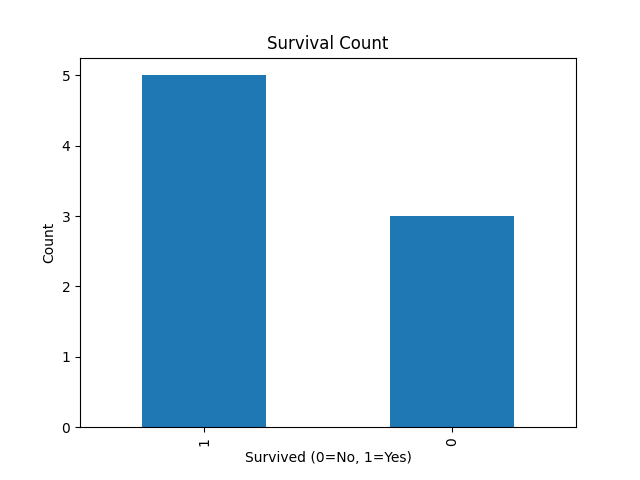
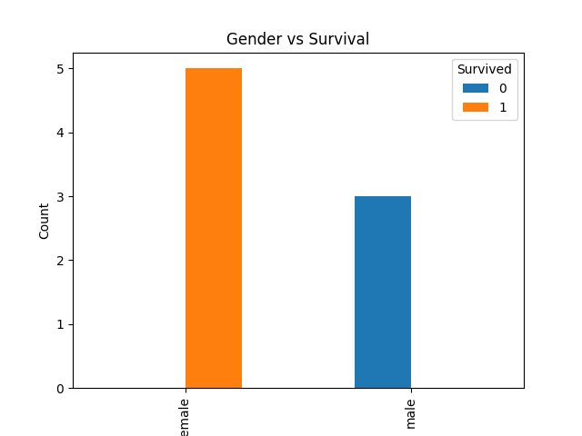
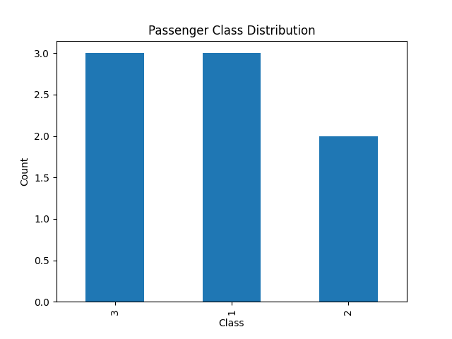

# 🚀 Titanic Data Cleaning & Preprocessing

## 📖 Problem Statement
The objective of this project is to clean and preprocess the Titanic dataset to improve data quality and prepare it for analysis.

---

## 📂 Dataset
- Source: Kaggle Titanic Dataset
- File: titanic.csv
- Contains passenger details like age, gender, class, and survival status

---

## ⚙️ Data Cleaning Steps

### 1. Handling Missing Values
- Filled missing values in Age column using median
- Filled missing values in Embarked column using mode

### 2. Removing Unnecessary Columns
- Dropped Cabin column (too many missing values)

### 3. Removing Duplicates
- Removed duplicate records to ensure data consistency

### 4. Data Preparation
- Cleaned and structured dataset for further analysis

---

## 🖼️ Data Preview
(Add image here later)

---

## ✅ Output
- Clean dataset saved as cleaned_titanic.csv
- Data ready for analysis and modeling

---

## 💡 Key Learnings
- Importance of data cleaning
- Handling missing values effectively
- Preparing data for machine learning

---

## 🛠️ Tools Used
- Python
- Pandas

---
## 📊 Visualizations

### Survival Count

### Gender vs Survival

### Passenger Class Distribution

